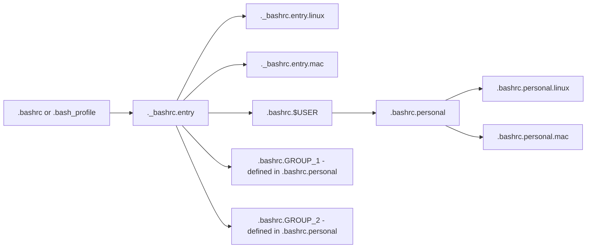

```mermaid
graph LR
    A[.bashrc or .bash_profile]
    B[._bashrc.entry]
    C[._bashrc.entry.linux]
    D[._bashrc.entry.mac]
    E[.bashrc.$USER]
    F[.bashrc.personal]
    G[.bashrc.personal.linux]
    H[.bashrc.personal.mac]
    I[.bashrc.GROUP_1 - defined in .bashrc.personal]
    J[.bashrc.GROUP_2 - defined in .bashrc.personal]
    A --> B
    B --> C
    B --> D
    B --> E
    E --> F
    F --> G
    F --> H
    B --> I
    B --> J
```
