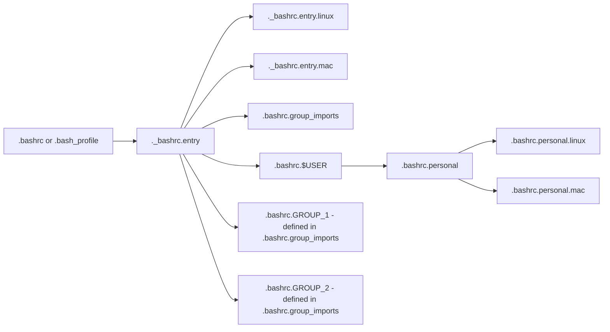

Bash entry is a generic set of helper functions, with the ability to load additional configurations

Once setup:
- `.bashrc` (or `.bash_profile`) loads `._bashrc.entry`
- `._bashrc.entry` loads `._bashrc.entry.mac` and/or `._bashrc.entry.linux` for platform-specific implementations of functions
- `._bashrc.entry` loads `.bashrc.{USER}` (ex, `.bashrc.nate`) for personal functions
  - `.bashrc.{USER}` is aliased to `.bashrc.personal` for consistent naming for importing
  - `.bashrc.personal` loads `.bashrc.personal.mac` and `.bashrc.personal.linux` for platform-specific implementations of personal functions
- `._bashrc.entry` loads `.bashrc.group_imports`
  - `.bashrc.group_imports` defines a `BASHRC_GROUPS` variable, a list of additional profiles to load (e.g. specific work profiles)
  - Each group defined in `BASHRC_GROUPS` will load a corresponding `.bashrc.{GROUP}` file
    - For example, if `BASHRC_GROUPS` contains "easypost", then `.bashrc.easypost` will be loaded
    - The `.bashrc.group_imports` file is auto-generated by running work-specific installation scripts, and should not be manually edited or committed.

